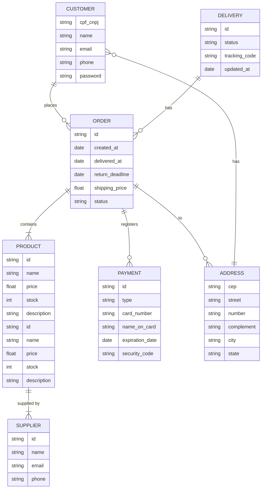

# Modelagem de Banco de Dados de um E-Commerce

```mermaid
erDiagram
          CUSTOMER ||--o{ ORDER : "places"
          CUSTOMER {
            string cpf_cnpj
            string name
            string email
            string phone
            string password
          }
          ORDER {
            string id
            date created_at
            date delivered_at
            date return_deadline
            float shipping_price
            string status
          }
          ORDER ||--|{ PRODUCT : "contains"
          ORDER ||--o{ PAYMENT : "registers"
          PRODUCT {
            string id
            string name
            float price
            int stock
            string description
          }
          PAYMENT {
            string id
            string type
            string card_number
            string name_on_card
            date expiration_date
            string security_code
          }
          PRODUCT ||--|{ SUPPLIER : "supplied by"
          PRODUCT {
            string id
            string name
            float price
            int stock
            string description
          }
          SUPPLIER {
            string id
            string name
            string email
            string phone
          }
          ADDRESS ||--o{ CUSTOMER : "has"
          ADDRESS {
            string cep
            string street
            string number
            string complement
            string city
            string state
          }
          ORDER ||--o{ ADDRESS : "to"
          DELIVERY ||--o{ ORDER : "has"
          DELIVERY {
            string id
            string status
            string tracking_code
            date updated_at
          }
```